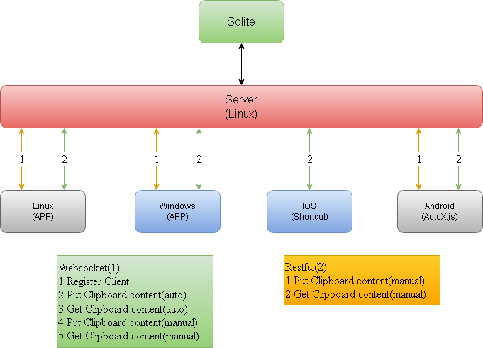

## 1. Architecture


## 2. Usage
### 2.1 Server
#### 2.1.1 server config file
```yaml
# Server listen ip:port
addr: 0.0.0.0:443
# Authentication info list
auths:
  - user: "user1"
    password: "passwd1"
  - user: "user2"
    password: "passwd2"
  - user: "user3"
    password: "passwd3"
max-msg-size: 104857600
websocket-path: "/websocket"
certificate:
  cert-file: "../certificate/ssl.crt"
  key-file: "../certificate/ssl.key"
log:
  # if no log file is specified, will use stdout
  path: "./server.log"
  log-level: "info"
```
#### 2.1.2 start command
```shell
./server -d /path/to/server-config/directory -f /path/to/config/file
```
> If no configuration file (-f) is specified, the system will automatically search for the default configuration file named **server.yaml** in the configuration directory.
### 2.2 Client
#### 2.2.1 client config file
```yaml
server: 127.0.0.1
port: 443
# must same as the server config
websocket-path: "/websocket"
log:
  # if no log file is specified, will use stdout
  path: ./client.log
  log-level: info
auth:
  user: user1
  password: passwd1

# If using a self-signed certificate, then this value needs to be set to true.
skip-cert-verify: true

# auto: Automatically retrieve content from the clipboard, upload it to the server, and have the server automatically push content back to the client.
# manual: Manual upload or download of content is required.
mode: manual
```

#### 2.2.2 start command
```shell
./client -d /path/to/client-config/directory -f /path/to/config/file
```
> If no configuration file (-f) is specified, the system will automatically search for the default configuration file named **client.yaml** in the configuration directory.

#### 2.2.3 hotkey
Modifier key combos are separated with a `+` and are prepended to a key in a consistent order as follows: `Control+Alt+Shift+KEY`.

`Modifier Key`: Control Alt Shift
`KEY`: A B C .etc, use upcase character, Space Left Rigth Up Down